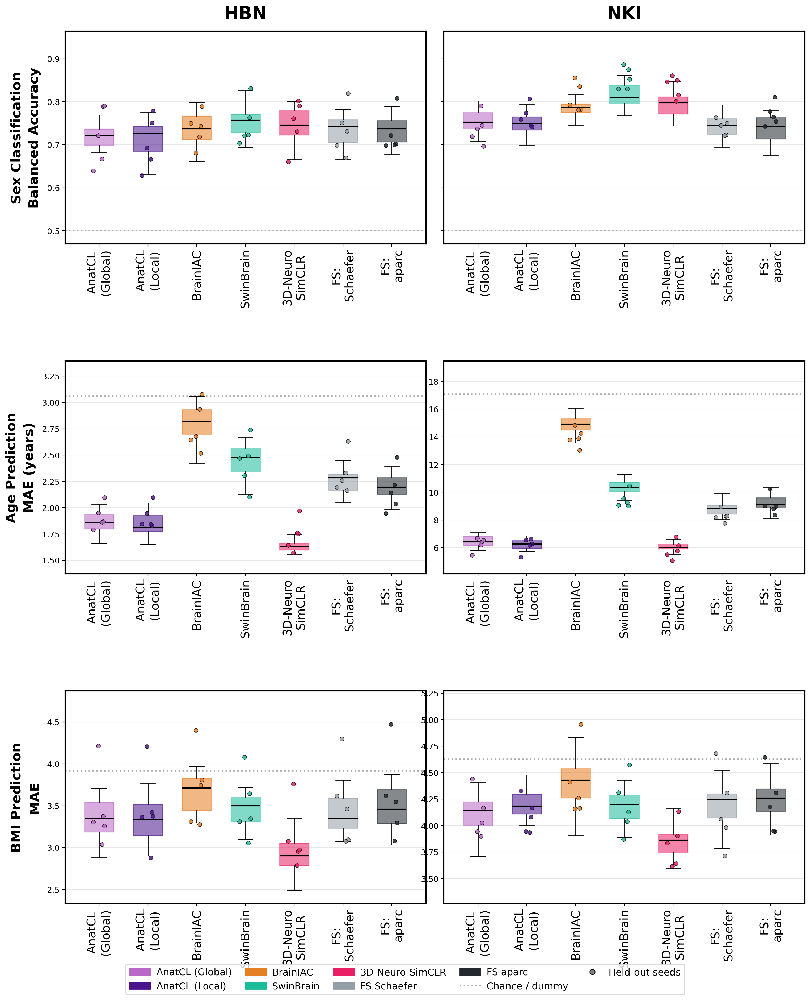

[](https://www.biorxiv.org/content/10.64898/2026.05.15.725427v3)

# BrainFMBench

A living benchmark for **brain structural MRI foundation models**. Contributors
submit a model; model is applied to MRI datasets to extract features; features are
fed into downstream learners; the leaderboard updates automatically.

<!-- LEADERBOARD:START -->



| Model | Dataset | Sex (acc) | Age (MAE) | BMI (MAE) |
|-------|---------|-----------|-----------|-----------|
| SwinBrain | NKI | 0.855 ± 0.023 | 9.47 ± 0.54 | 4.18 ± 0.24 |
| Default Untrained 3D CNN | NKI | 0.847 ± 0.036 | 10.00 ± 0.47 | 4.00 ± 0.27 |
| 3D-Neuro-SimCLR | NKI | 0.835 ± 0.023 | 5.86 ± 0.58 | 3.83 ± 0.19 |
| BrainIAC | NKI | 0.810 ± 0.031 | 13.96 ± 0.59 | 4.39 ± 0.30 |
| FS aparc | NKI | 0.770 ± 0.023 | 9.09 ± 0.63 | 4.20 ± 0.26 |
| AnatCL (Local) | NKI | 0.765 ± 0.024 | 6.19 ± 0.47 | 4.09 ± 0.15 |
| 3D-Neuro-SimCLR | HBN | 0.749 ± 0.051 | 1.74 ± 0.14 | 3.11 ± 0.34 |
| SwinBrain | HBN | 0.748 ± 0.046 | 2.42 ± 0.21 | 3.49 ± 0.35 |
| FS Schaefer | NKI | 0.740 ± 0.016 | 8.29 ± 0.38 | 4.15 ± 0.33 |
| AnatCL (Global) | NKI | 0.738 ± 0.031 | 6.26 ± 0.43 | 4.09 ± 0.20 |
| BrainIAC | HBN | 0.737 ± 0.036 | 2.77 ± 0.21 | 3.71 ± 0.41 |
| FS Schaefer | HBN | 0.734 ± 0.051 | 2.32 ± 0.17 | 3.51 ± 0.45 |
| FS aparc | HBN | 0.726 ± 0.042 | 2.16 ± 0.18 | 3.60 ± 0.48 |
| AnatCL (Global) | HBN | 0.721 ± 0.062 | 1.91 ± 0.10 | 3.44 ± 0.40 |
| AnatCL (Local) | HBN | 0.703 ± 0.055 | 1.91 ± 0.10 | 3.45 ± 0.43 |

_Ranking varies by task and dataset; there is no single overall winner._

<!-- LEADERBOARD:END -->


## Leaderboard

See [`LEADERBOARD.md`](LEADERBOARD.md) for the current ranking and the figure. Scores are downstream RandomForest probes of frozen
features (5-fold CV across 5 seeds for the box, held-out test for the points).

## Tasks & data

Models are evaluated on two datasets from the [Reproducible Brain Charts](https://reprobrainchart.github.io) (RBC)
initiative:

- **NKI** — Nathan Kline Institute Rockland Sample (~958 subjects)
- **HBN** — Healthy Brain Network (~1000 subjects)

Models are evaluated across three tasks: **sex** classification (balanced accuracy) and **age** / **BMI**
regression (mean absolute error). Preprocessing is [turboprep](https://github.com/LemuelPuglisi/turboprep) by default, with
[CAT12](https://neuro-jena.github.io/cat/) also available.

## How it works

BrainFMBench splits the work between a computing cluster and GitHub actions:

```
  contributor PR                     Compute Canada (rorqual)          GitHub Actions
  ─────────────                      ────────────────────────         ─────────
  model.yaml                                                          validate PR
  extract.py        ── merge ──▶     extract features    ──▶       score features
  weights.txt                        (on preprocessed data)               │
                                                                       leaderboard
                                                                       updates
```

- **Feature extraction runs on the cluster**, against preprocessed data. Only the resulting feature vectors come back.
- **Scoring runs in CI**, publicly and reproducibly, so anyone can verify how a
  leaderboard numbers were produced.

## Repository layout

```
models/<name>/          submitted models (model.yaml + features, or + extract.py)
labels/<DS>.csv         shared task labels per dataset (subject_id, sex, age, bmi)
eval/scorer.py          the downstream probing protocol
scripts/                scoring, leaderboard, and submission validation
cluster/                the async cluster runner (reap/sow) + sbatch template
example-submission/     a minimal, working submission you can copy
.github/workflows/      validation, scoring, and cluster-extraction workflows
```

## Contributing a model

See [`CONTRIBUTING.md`](CONTRIBUTING.md) for the full guide. In short, open a PR
adding `models/<your-model>/` with:

- **`model.yaml`** — metadata (name, preprocessing, embedding_dim, datasets, tasks)
- **`extract.py`** — defines `extract(input_dir, output_csv, weights_dir)`
- **`weights.txt`** — direct-download URL(s) to your checkpoint(s) (HuggingFace,
  Zenodo, etc.)

Copy [`example-submission/`](example-submission/) as a starting point. A PR
validation check runs your `extract.py` on a synthetic volume before anything
touches the cluster. Because extraction runs on our allocation, only
maintainer-reviewed submissions are executed.

## Scoring protocol

For each model / dataset / task, at the full training size:

- **Box** = 5-fold cross-validation across 5 seeds (25 values)
- **Points** = held-out test result for the same 5 seeds
- RandomForest probe (200 trees, depth 6) on standardized features; balanced
  accuracy for sex, MAE for age / BMI.

Dependencies are pinned (scikit-learn 1.7.1, numpy 2.4.2, pandas 2.2.3) so the
leaderboard is reproducible run to run.
